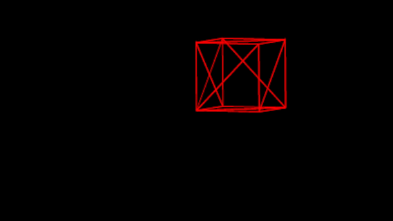

# <ins>Rusty Rasterizer</ins>
A 3D Software Rasterizer written in Rust

## <ins>Crates</ins>
* MiniFB (Window/Frame Buffer Handling)
* Raqote (2D Drawing Functions)

### <ins>Goals</ins>
* Implement the graphics pipeline from scratch on the CPU
* Render 3D meshes using the .obj format

#### Milestone 1 (Render a Wiremesh Cube 12/21/23):
